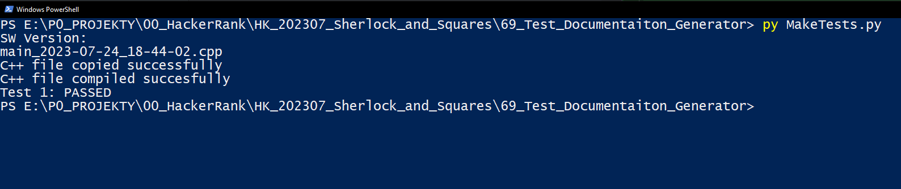

<!-- PROJECT LOGO -->
 
 
 

    
    
    
    
  </a>
 
 
 
<h2 align="center"> Test Framework for HackerRank problems  </h2>
 
 
 
<h3 align="center"> Sherlock_and_Squares  </h3>
 
 
 

<!-- TABLE OF CONTENTS -->
## Project Use

## Project Preparation
## Project Structure
## Dependencies 

## Tests
### Acceptance Level - Main Algorithm Test
### Acceptance Level - Code Test
## Links
<!-- MARKDOWN LINKS & IMAGES -->
<!-- https://www.markdownguide.org/basic-syntax/#reference-style-links -->
