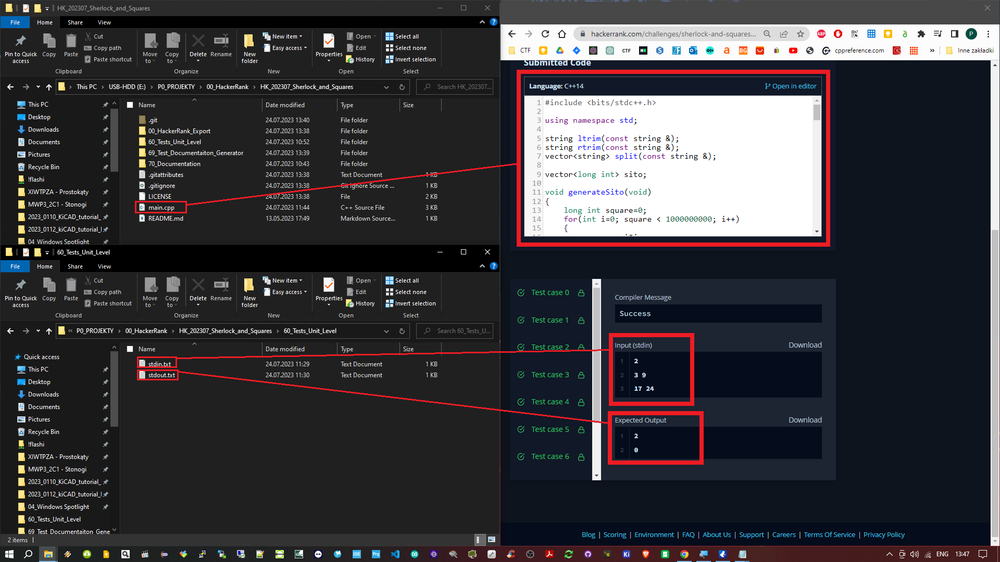

<!-- PROJECT LOGO -->
 

    
  </a>

<h3 align="center"> HK_202307_Sherlock_and_Squares  </h3>

<!-- TABLE OF CONTENTS -->
## Project Use
## Project Preparation
## Project Structure
## Dependencies 

## Tests
### Acceptance Level - Main Algorithm Test
### Acceptance Level - Code Test
## Links
<!-- MARKDOWN LINKS & IMAGES -->
<!-- https://www.markdownguide.org/basic-syntax/#reference-style-links -->
